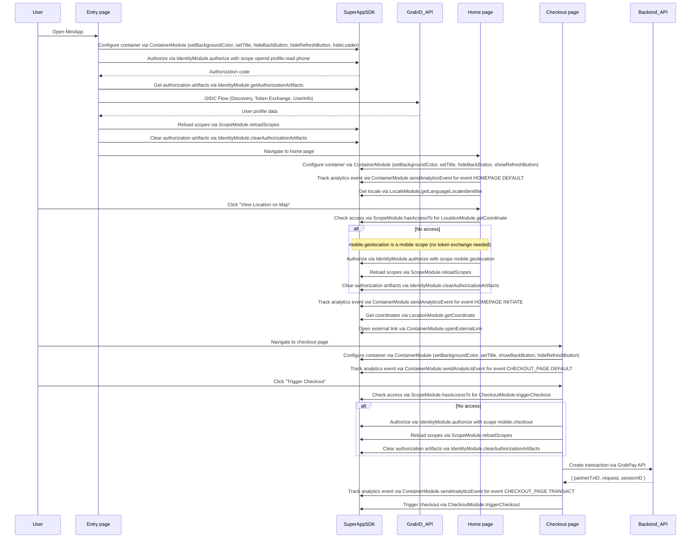

# Demo MiniApps

Two complete MiniApp samples demonstrating core Grab SuperApp SDK integration patterns. Both implement the same user flow — OAuth authorization, user profile display, deferred location permissions, and checkout payment — in different technology stacks.

**Note:** These MiniApps must be opened within the Grab SuperApp WebView environment to function correctly, as they rely on native bridge capabilities provided by the Grab app.

## Variants

| Variant | Stack | Description |
|---------|-------|-------------|
| `cdn/` | Vanilla HTML/JS | Zero-build, loads SDK via CDN. Uses the global `SuperAppSDK` object. |
| `react/` | React + TypeScript + Vite | Build-based, imports SDK as an npm package. Hot-reload dev server. |

## Security

Token exchange and userinfo retrieval are performed **in the browser only for this demonstration**. In production, you must exchange the authorization code, validate tokens, and fetch user information **on your backend** to ensure security and prevent token exposure.

## Configure

1. Open `cdn/config.js` (or `react/src/config.ts`).
2. Set `ENVIRONMENT` to `'staging'` or `'production'`.
3. Replace placeholders with your `clientId` and `redirectUri` (must match your Grab partner registration).
4. If testing locally, ensure `redirectUri` points to your served entry URL (`entry.html` or `http://localhost:5173`).

## Testing

Developers who want to pull this code, update it, and test it out, should liaise with the Grab team to set up the environment.

## CDN Variant

Zero-build: open the HTML files directly via a local server (e.g. `npx serve .`).

```
cdn/
├── entry.html        OAuth authorization and demo OIDC flow
├── index.html        User profile display and deferred location permissions
├── checkout.html     Payment flow and checkout permission handling
├── config.js         Centralized environment and OAuth client configuration
├── ui-helpers.js     Shared UI utilities for error handling and HTML escaping
└── grabid-service.js Demo-only OIDC helpers (Discovery, Token Exchange, UserInfo)
```

Run locally:
```bash
npx serve cdn
# Then open http://localhost:3000/entry.html
```

## React Variant

Build-based with TypeScript and Vite:

```
react/
├── src/
│   ├── App.tsx               Root component with routing
│   ├── config.ts             Environment and OAuth client configuration
│   ├── pages/
│   │   ├── EntryPage.tsx     OAuth authorization and OIDC flow
│   │   ├── IndexPage.tsx     User profile display and deferred location permissions
│   │   └── CheckoutPage.tsx  Payment flow and checkout permission handling
│   ├── services/
│   │   └── grabidService.ts  Demo-only OIDC helpers
│   └── context/
│       └── UserContext.tsx   User profile state management
└── dist/                     Pre-built output (ready to serve)
```

Install and run:
```bash
cd react
npm install
npm run dev
```

## Integration Flow



## Production Checklist

- **Backend Integration**: Move OAuth code exchange and UserInfo calls to your server.
- **Transaction Initialization**: Always initialize transactions on your backend via the GrabPay API before calling `CheckoutModule.triggerCheckout()`.
- **Token Validation**: Always validate `id_token` signatures and nonces server-side.
- **Secure Storage**: Use secure, HTTP-only cookies or server-side sessions instead of `sessionStorage` for sensitive identity data.
- **Client Secrets**: Never expose client secrets in frontend code.