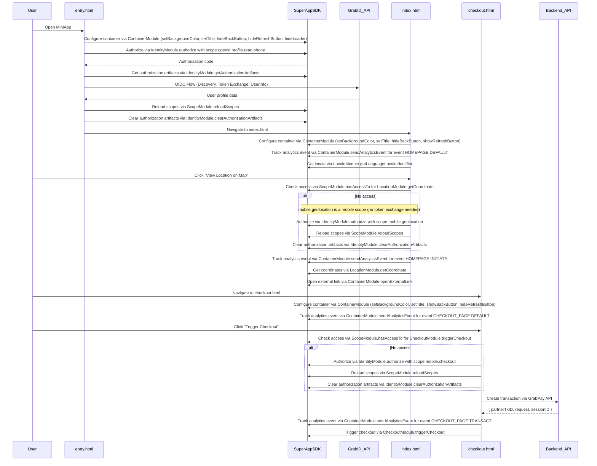

# CDN demo

A zero-build MiniApp demonstration showcasing core Grab SuperApp SDK integration patterns. This sample loads the SDK via CDN and uses the global `SuperAppSDK` object to interact with native container, identity, and checkout modules.

**Note:** This MiniApp must be opened within the Grab SuperApp WebView environment to function correctly, as it relies on native bridge capabilities provided by the Grab app.

## Security

Token exchange and userinfo retrieval are performed **in the browser only for this demonstration**. In production, you must exchange the authorization code, validate tokens, and fetch user information **on your backend** to ensure security and prevent token exposure.

## Configure

1. Open `config.js`.
2. Set `ENVIRONMENT` to `'staging'` or `'production'`.
3. Replace placeholders with your `clientId` and `redirectUri` (must match your Grab partner registration).
4. If testing locally, ensure `redirectUri` points to your served `entry.html` URL.

## Testing

Developers who want to pull this code, update it, and test it out, should liaise with the Grab team to set up the environment.

## Integration Flow

## File Breakdown

| File | Responsibility |
|------|----------------|
| `entry.html` | Handles initial OAuth authorization and demo OIDC flow. |
| `index.html` | Displays user profile and demonstrates deferred location permissions. |
| `checkout.html` | Demonstrates the payment flow and checkout permission handling. |
| `config.js` | Centralized environment and OAuth client configuration. |
| `ui-helpers.js` | Shared UI utilities for error handling and HTML escaping. |
| `grabid-service.js` | Demo-only OIDC helpers (Discovery, Token Exchange, UserInfo). |

## Production Checklist

- **Backend Integration**: Move OAuth code exchange and UserInfo calls to your server.
- **Transaction Initialization**: Always initialize transactions on your backend via the GrabPay API before calling `CheckoutModule.triggerCheckout()`.
- **Token Validation**: Always validate `id_token` signatures and nonces server-side.
- **Secure Storage**: Use secure, HTTP-only cookies or server-side sessions instead of `sessionStorage` for sensitive identity data.
- **Client Secrets**: Never expose client secrets in frontend code.
